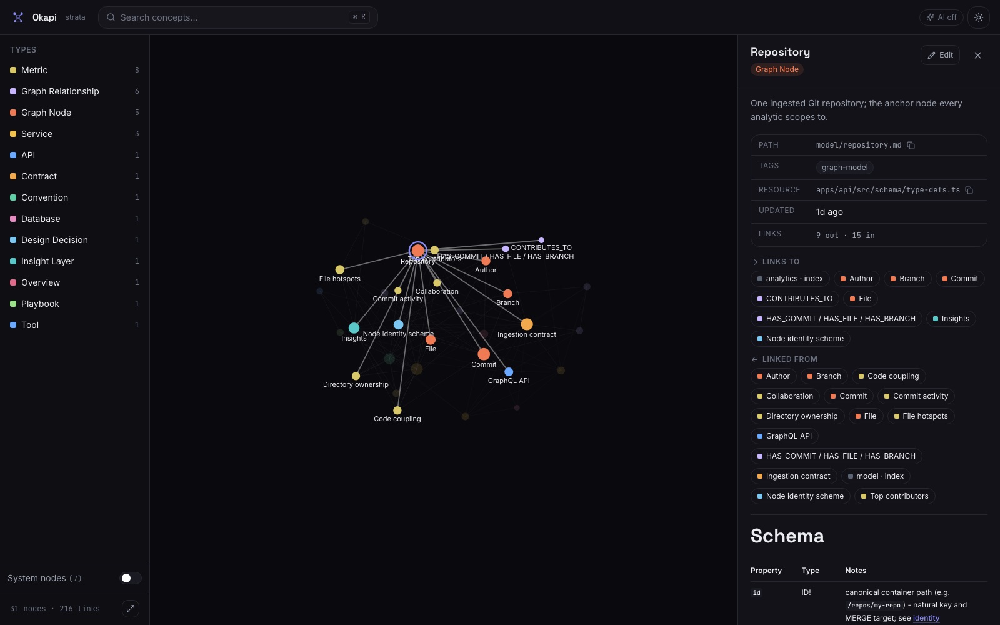
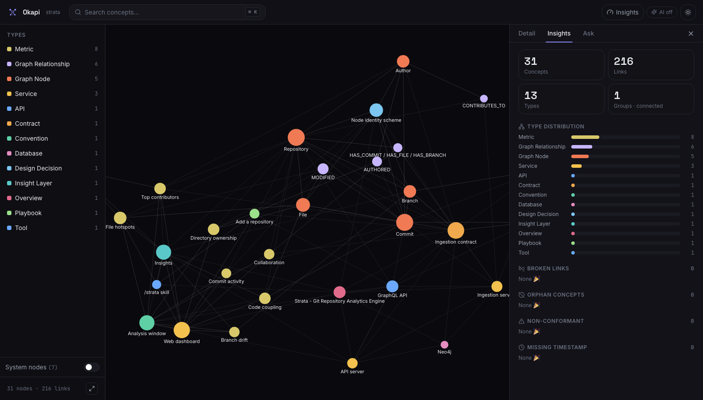

<div align="center">
  
  <h1>Okapi</h1>
  <p><strong>An OKF Knowledge Studio.</strong> See, understand, audit, edit, and <em>query</em> any Open Knowledge Format bundle from one command.</p>

  <p>
    <a href="https://www.npmjs.com/package/okapi-okf"></a>
    =20" />
    
  </p>

  
</div>

---

## What is Okapi?

[OKF (Open Knowledge Format)](https://github.com/GoogleCloudPlatform/knowledge-catalog/blob/main/okf/SPEC.md)
represents knowledge as a directory of markdown files with YAML frontmatter,
cross-linked by plain markdown links. It's a vendor-neutral way to describe a
system, a data catalog, or any body of knowledge — for humans **and** for AI agents.

Okapi turns any OKF bundle into an interactive studio:

- 🕸️ **Interactive graph** — every concept as a node, sized by how connected it is, colored by type. Filter by type, hide structural files, search, and focus.
- 📖 **Rich detail panel** — frontmatter metadata, fully-rendered markdown (tables, code, GFM), and in-app navigation between linked concepts.
- ✍️ **In-browser editing** — edit the underlying `.md` file with a live-preview editor and save straight to disk.
- 📊 **Insights** — orphans, broken links, disconnected groups, stale timestamps, type distribution — computed instantly, click to focus.
- ✦ **Ask the bundle (AI)** — ask questions in plain English and get answers grounded in the bundle, with citations that light up the graph. Opt-in, bring-your-own key.
- ✅ **`okapi lint`** — OKF conformance checking that mirrors the reference validator.

<div align="center"></div>

## Quick start

```bash
npx okapi-okf ./path/to/bundle
```

That parses the bundle, starts a local server, and opens your browser. That's it.

> Try it against the reference example bundle from the OKF spec, or any directory of markdown concept files.

## Install

| Method | Command | For |
|---|---|---|
| **npx** (zero-install) | `npx okapi-okf ./bundle` | Anyone with Node ≥ 20 |
| **npm global** | `npm i -g okapi-okf` then `okapi ./bundle` | Engineers |
| **Homebrew** | `brew install sebastienfi/tap/okapi` | macOS / Linux |
| **Prebuilt binary** | download from [Releases](https://github.com/sebastienfi/okapi-okf-knowledge-studio/releases) | No Node required |

## CLI

```
okapi [bundle] [options]

  bundle                 Path to an OKF bundle directory (default ".")
  -p, --port <number>    Preferred port (auto-increments if taken)   [4317]
  --host <host>          Host to bind                                 [127.0.0.1]
  --no-open              Don't open the browser automatically
  --no-watch             Don't watch the bundle for changes
  --ai                   Enable AI features (needs OPENAI_API_KEY or ANTHROPIC_API_KEY)
  --provider <name>      AI provider: openai | anthropic (default: openai if its key is set)
  -v, --version          Print version

okapi lint [bundle] [--strict] [--check-links] [--json]
  Check OKF conformance. Exit code 1 if not conformant.
```

## AI setup & privacy

Okapi's "Ask the bundle" feature is **off by default** and supports **OpenAI** or
**Anthropic**. To enable it, set a key and pass `--ai`:

```bash
export OPENAI_API_KEY=sk-...        # or ANTHROPIC_API_KEY=sk-ant-...
okapi ./bundle --ai
```

- **Opt-in.** Nothing is sent anywhere unless you pass `--ai`.
- **Bring your own key.** Okapi uses your key directly; you control the spend.
- **What's sent.** When you ask a question, the relevant concept text from your bundle plus your question are sent to the provider to generate the answer. Everything else in Okapi works fully offline.
- **Choosing a provider.** OpenAI is the default when `OPENAI_API_KEY` is set. If both keys are present, pick one with `--provider openai|anthropic` (or `OKAPI_PROVIDER`).
- **Model.** Defaults to `gpt-5.5` (OpenAI) or `claude-opus-4-8` (Anthropic). Override with `OKAPI_MODEL` — set it to a model your chosen provider supports (e.g. `gpt-4o`, `claude-haiku-4-5`).

## Configuration

| Variable | Purpose | Default |
|---|---|---|
| `OPENAI_API_KEY` | OpenAI key (used by default for `--ai`) | — |
| `ANTHROPIC_API_KEY` | Anthropic key | — |
| `OKAPI_PROVIDER` | `openai` or `anthropic` when both keys are set | `openai` |
| `OKAPI_MODEL` | Model for AI answers (must match the provider) | provider default |

## How it works

```
packages/core   Pure parser: walk → frontmatter → markdown-AST link extraction → resolve → graph + conformance
packages/cli    Hono server (graph/node/save/watch/AI) + the `okapi` CLI  (published as "okapi-okf")
apps/web        React + Vite SPA: force-directed graph, detail panel, editor, insights, Ask
```

The graph is the OKF **document** graph: nodes are `.md` files, edges are the markdown links between them. Link resolution mirrors the OKF reference validator exactly — code fences and `resource:` frontmatter never become edges, and broken links are reported (never dangling). See [docs/ARCHITECTURE.md](docs/ARCHITECTURE.md).

## Development

```bash
pnpm install
pnpm dev              # Vite (5173) + API (4317) against okf/ (Okapi's own bundle)
pnpm test             # unit + in-process API tests
pnpm build            # build web + cli
pnpm lint             # Biome
```

See [CONTRIBUTING.md](CONTRIBUTING.md).

## License

[MIT](LICENSE) © Sébastien Fichot and Okapi contributors.
